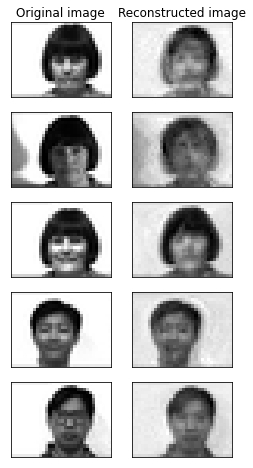
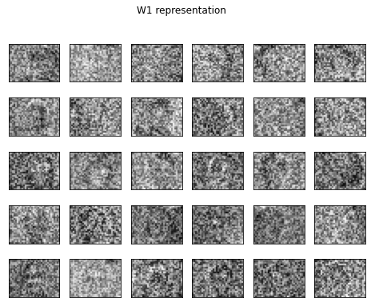
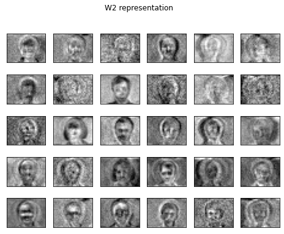

# Autoencoder from Scratch
Exploring latent spaces using Autoencoder architecture

The project was created as a part of Neural Network course at Radboud University led by Prof. Marcel van Gerven.
The code is written in colaboration with Benjamin Gerritsen, Anna Kuznetsova and Max Kulicki.

We wrote an algorithm that utilises Autoencoder architecture from scratch. The neural network has 2 hidden layers, which we visualise. We test our code on Yale faces dataset. 

Examples of reconstruction:

Latent spaces:

First hidden layer:

Second hidden layer:

